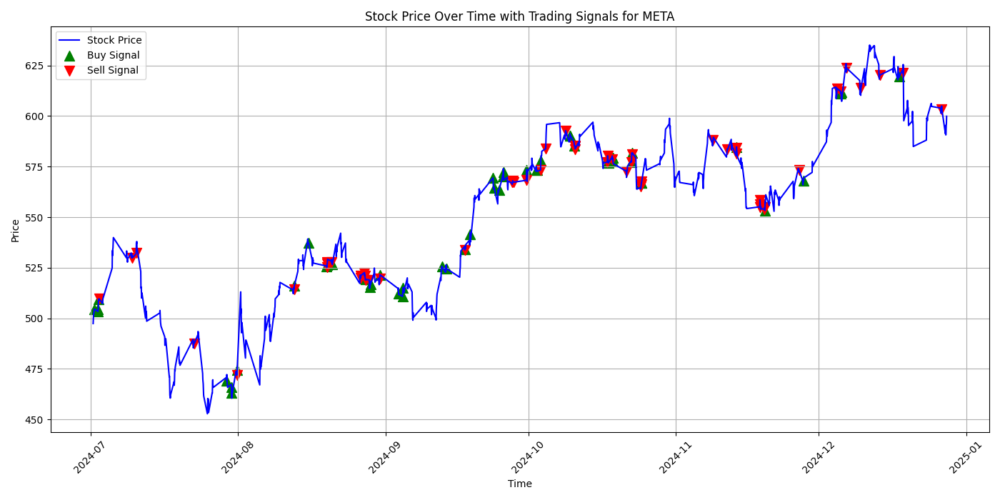
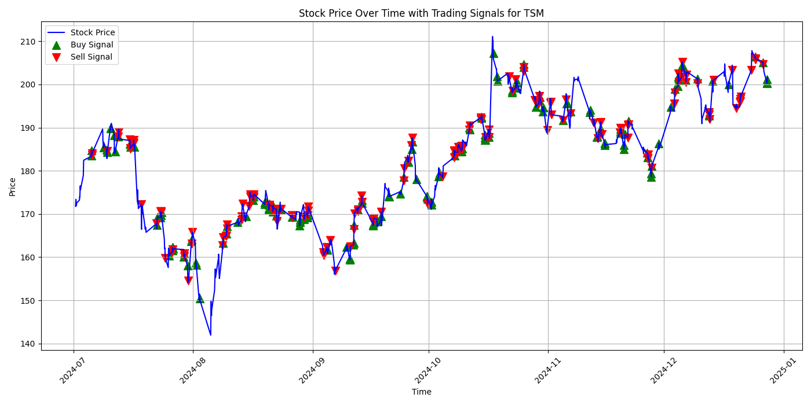
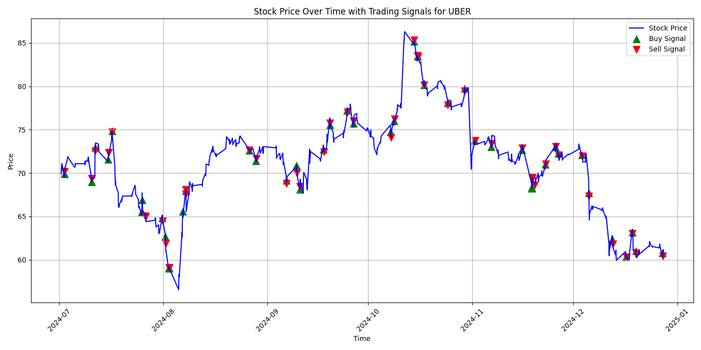
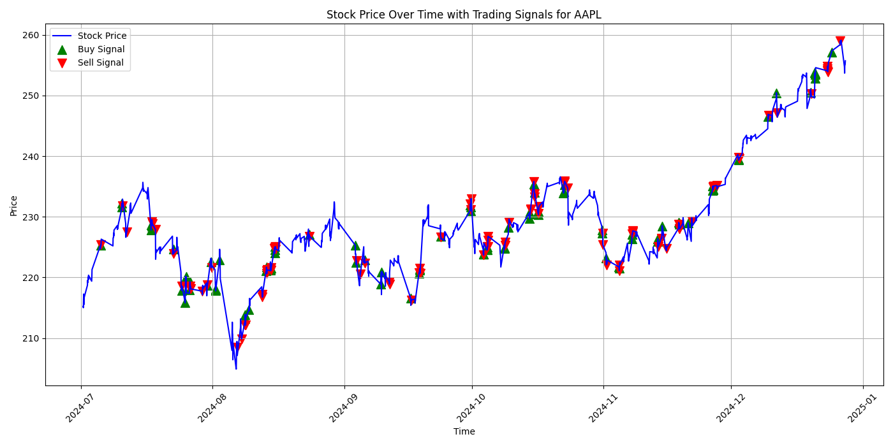
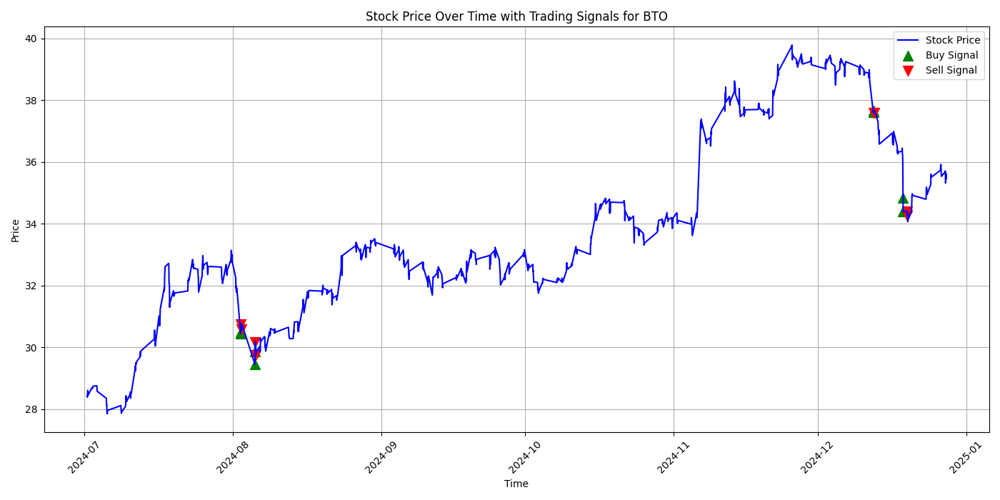
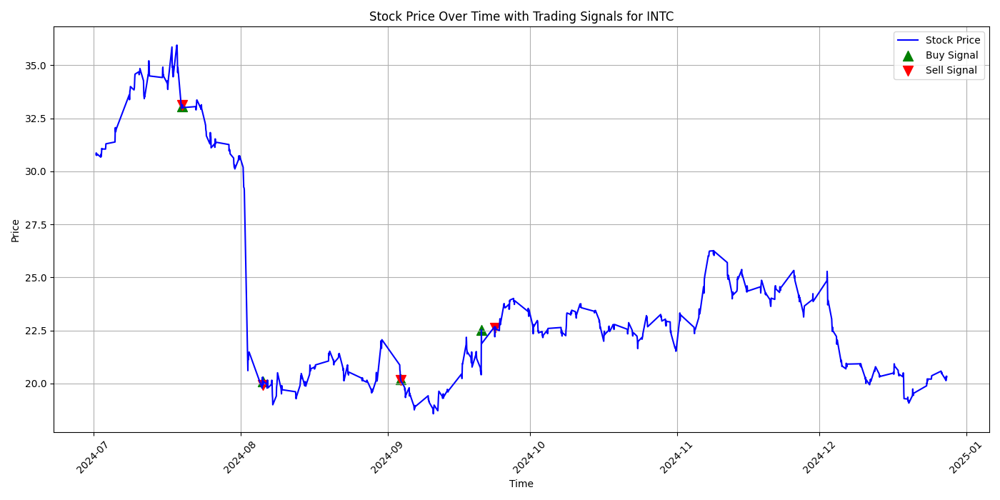
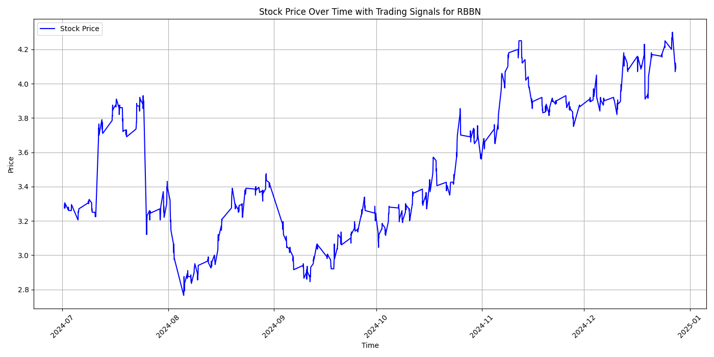

# 📊 Experimental Results

This page summarizes the performance of the SARSA trading agent on various stocks.

> 📅 **Training Period**: 2023-06-01 to 2024-06-30  
> 💡 The model was tested across multiple stocks and the following plots show the buy/sell signals.  

---

## 🧪 META

**Total Profit:** `$743.50`

---

## 🧪 TSM

**Total Profit:** `$609.29`

---

## 🧪 UBER

**Total Profit:** `$0.06`

---

## 🧪 AAPL

**Total Profit:** `$-16.63`

---

## 🧪 BTO

**Total Profit:** `$0.37`

---

## 🧪 INTC

**Total Profit:** `$0.00`

---

## 🧪 RBBN

**Total Profit:** `$0.00`

---

